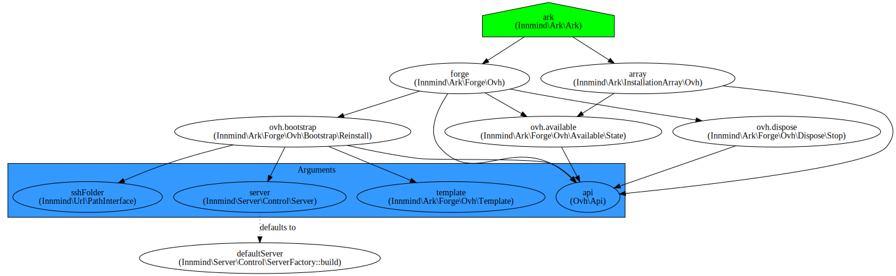

# Ark

| `master` | `develop` |
|----------|-----------|
| [](https://scrutinizer-ci.com/g/Innmind/Http/?branch=master) | [](https://scrutinizer-ci.com/g/Innmind/Http/?branch=develop) |
| [](https://scrutinizer-ci.com/g/Innmind/Http/?branch=master) | [](https://scrutinizer-ci.com/g/Innmind/Http/?branch=develop) |
| [](https://scrutinizer-ci.com/g/Innmind/Http/build-status/master) | [](https://scrutinizer-ci.com/g/Innmind/Http/build-status/develop) |

The ark is a simple tool to spinup new servers and trash the ones in service in your infrastructure.

Currently it only works with the [Ovh](https://ovh.com) api and uses the vps endpoints. Since it's not possible to order new servers via the api this library rely on the state of your servers.

If a server is stopped it considers that it is available when asking for a new server. When a server is chosen as a new server it will reinstall the server with a [template id](https://eu.api.ovh.com/console/#/vps/%7BserviceName%7D/templates#GET) that you must provide, the only way to connect to the server will be via a ssh key (no password is generated as we couldn't automate the reinstallation).

Only the installation provided by the ark array can be asked to be disposed. With ovh disposing a server simply means it will stop the server (allowing it to be considered as available when asking for a new server).

## Installation

```sh
composer require innmind/ark
```

## Usage

The very first step is to buy vps servers from [ovh](https://www.ovh.com/fr/vps/), then you can start writing this kind of code:

```php
use Innmind\Ark\Forge\Ovh\Template;
use Innmind\Compose\ContainerBuilder\ContainerBuilder;
use Innmind\Url\Path;
use Innmind\Immutable\Map;
use Ovh\Api;

$container = (new ContainerBuilder)(
    new Path('container.yml'),
    (new Map('string', 'mixed'))
        ->put('api', new Api(/* args */))
        ->put('template', new Template($someTemplateId))
        ->put('sshFolder', '/home/{serverUser}/.ssh')
);

$installation = $forge->new();
$installAppOn($installation->location());
$installation->array(); // will contain the new server now
```

You can refer to the [ovh documentation](https://api.ovh.com/g934.first_step_with_api) to know how you can generate the tokens needed to build the `Api` object.

**Important**: you need to generate the consumer key yourself as it can't be automated. The library requires the following access rights in order to work properly: `POST</me*>`, `DELETE</me*>`, `GET</vps*>` and `POST</vps*>`.

## Tech

Below is the dependency graph of this tool in case you want to understand the inner working.


